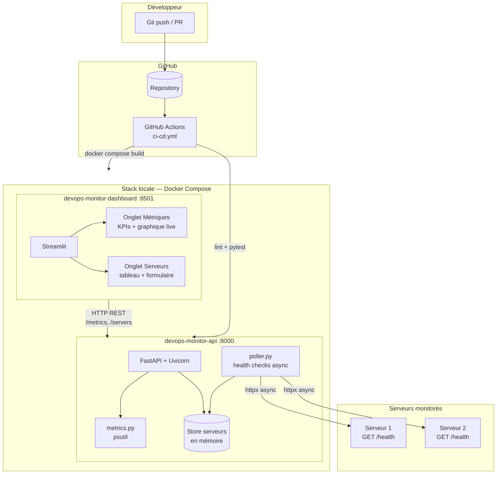
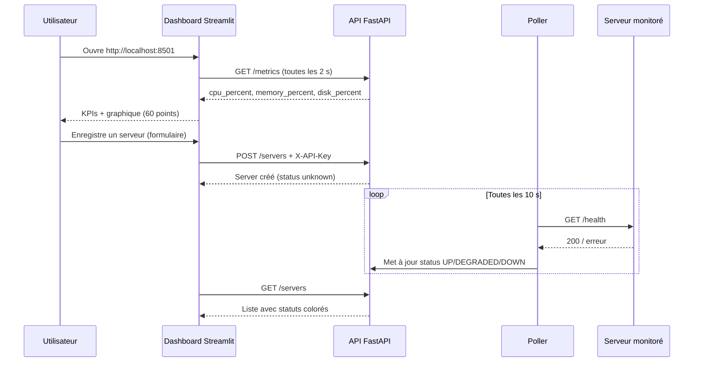
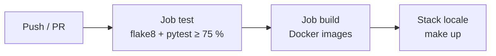

# DevOps Monitoring Dashboard

Système de monitoring temps réel en Python : API FastAPI + dashboard Streamlit, containerisé avec Docker et validé par un pipeline GitHub Actions.

## Architecture

### Vue d'ensemble



### Flux des données



### CI/CD (local)



### Structure du dépôt

```
devops-monitor/
├── api/                  # Backend FastAPI (port 8000)
│   ├── main.py           # Routes, WebSocket, lifespan
│   ├── metrics.py        # Métriques psutil
│   ├── poller.py         # Health checks async
│   └── Dockerfile        # Build multi-stage
├── dashboard/            # Frontend Streamlit (port 8501)
│   ├── app.py
│   └── Dockerfile
├── tests/                # pytest (couverture ≥ 75 %)
├── docker-compose.yml    # Stack locale
├── Makefile              # Commandes standardisées
└── .env.example          # Template des variables d'environnement
```

**Services :**

| Service | URL locale | Rôle |
|---------|------------|------|
| API | http://localhost:8000 | Métriques, serveurs, WebSocket |
| Dashboard | http://localhost:8501 | Visualisation temps réel |
| Docs OpenAPI | http://localhost:8000/docs | Documentation interactive |

## Prérequis

- Python 3.11+
- Docker et Docker Compose
- Make

## Lancement local (Docker — recommandé)

```bash
cd devops-monitor
cp .env.example .env    # ajuster API_KEY si besoin
make up                 # build + démarrage en arrière-plan
make test               # lancer les tests
make logs               # suivre les logs
make down               # arrêter et supprimer les volumes
```

## Lancement local (sans Docker)

```bash
cd devops-monitor
make install
make dev                # API (:8000) + dashboard (:8501) en parallèle
```

Ou dans deux terminaux :

```bash
make run-api
make run-dashboard
```

## Tests et qualité

```bash
make lint               # flake8
make test               # pytest + couverture ≥ 75 %
make ci                 # lint + test (identique à la CI)
```

## Variables d'environnement

| Variable | Description | Exemple |
|----------|-------------|---------|
| `API_KEY` | Clé d'accès pour `POST /servers` et `DELETE /servers/{id}` | `dev-api-key` |
| `API_BASE_URL` | URL de l'API vue par le dashboard | `http://api:8000` (Docker) ou `http://localhost:8000` (local) |

> Ne jamais commiter le fichier `.env`. Seul `.env.example` est versionné.

## CI/CD

Le workflow `.github/workflows/ci-cd.yml` exécute sur chaque push et PR :

1. **test** — `flake8` + `pytest --cov=api --cov-fail-under=75`
2. **build** — construction des images Docker (push sur `main` uniquement)

## Endpoints API

| Méthode | Path | Auth | Description |
|---------|------|------|-------------|
| GET | `/health` | public | Liveness probe |
| GET | `/metrics` | public | Snapshot CPU / mémoire / disque |
| WS | `/ws/metrics` | public | Stream JSON toutes les secondes |
| POST | `/servers` | API key | Enregistrer un serveur |
| GET | `/servers` | public | Lister les serveurs |
| DELETE | `/servers/{id}` | API key | Supprimer un serveur |
| POST | `/servers/{id}/check` | public | Health check manuel |
